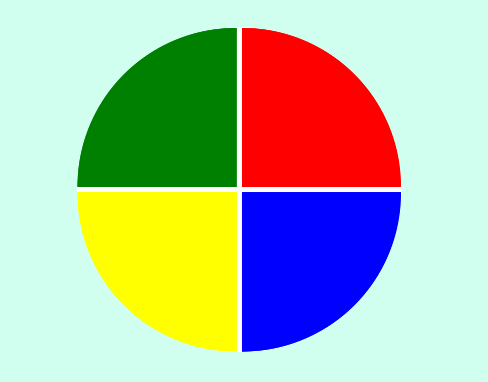

# Genius Color Game

Genius Color Game - A web-based game that challenges your memory and concentration skills.

## Description

This project is a web-based game inspired by the classic board game "Simon". The game challenges the player's memory and concentration skills by displaying a sequence of colored tiles, which the player must then repeat in the correct order. The game gets progressively more difficult as the sequence gets longer, and the player must complete the sequence without making a mistake.

The game is built using HTML5, CSS3, and JavaScript, and utilizes modern web development techniques such as CSS Grid, array manipulation, and arrow functions.

## Features

- Interactive and engaging gameplay
- Progressive difficulty levels
- Responsive design for seamless mobile play

## Technologies Used

- HTML5
- CSS3
- JavaScript

## Usage

To play the game, simply clone this repository and open the `index.html` file in your preferred web browser. The game will load automatically and you can start playing immediately. Alternatively, you can play the game live by visiting the [GitHub Pages site](https://Burntroll.github.io/genius-color-game/).

## Contributing

Contributions to this project are welcome! Feel free to fork this repository and submit a pull request with your changes.

## Credits

This project was built by [Francisco Silva](https://github.com/Burntroll).

## License

This project is licensed under the [MIT License](https://opensource.org/licenses/MIT).

## Results

